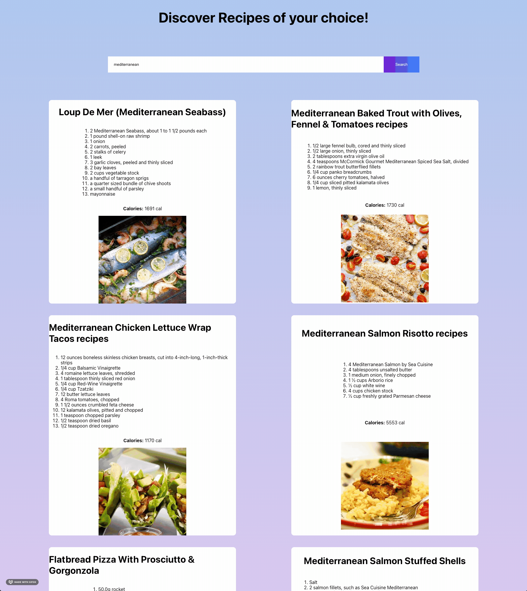

# React-recipe-app

This application is developed in a react js component and promise based design to search and discover food recipes based on thirdparty Recipe Search API (EDAMAM).

## User Story:

As a foodie, I want to discover recipes of your choice keyword to discover the recipes, ingredients and calories information to easily cook by yourself.

Hosted Url: https://deenuy.github.io/React-recipe-app/

## This repo contains:

- README.md
- react-recipe-app/src/components/Recipe.js
- react-recipe-app/src/components/recipe.module.css
- react-recipe-app/src/App.js
- react-recipe-app/src/index.js
- react-recipe-app/src/App.css for custom styling

## Usage:

On the main search bar, the user can type in the ingredient keyword and hit the Search button.

The website will return a maximum of 10 recipes, ingredients, images and calories information based on keyword search.

The data is retrieved from EDAMAM recipe search API, a reliable source for discovering nutritious recipes.

## Deployment:

- Assuming that you have a background of node js and necessary setup information
- Clone the git repository
- From mac terminal/ git bash, navigate to react-recipe-app in your cloned repository
- run
  - npm install
  - npm start

## Future Development:

- Enhance the user experience for discovering recipies with ingredients, diets and calories
- UI improvements

### Demo

## Credits:

- Inspired from 'Dev Ed' YouTube chanel
